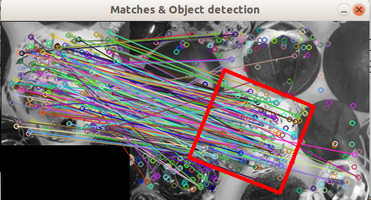
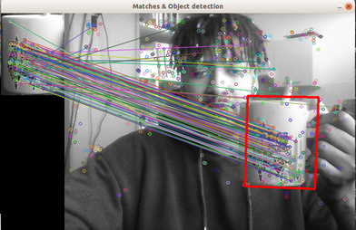

[![Contributors][contributors-shield]][contributors-url]
[![Forks][forks-shield]][forks-url]
[![Stargazers][stars-shield]][stars-url]
[![Issues][issues-shield]][issues-url]
[![MIT License][license-shield]][license-url]
[![LinkedIn][linkedin-shield]][linkedin-url]

<br />
<p align="center">
  <a href="https://github.com/Guilyx/cv-object-tracking>
    
                                                                               
  </a>

  <h3 align="center">Object Tracking with opencv</h3>

  <p align="center">
    Using SURF detection and FLANN matches, track objects from a selected area in a video or on your camera.
    <br />
    <a href="https://github.com/master-coro/cv-object-tracking"><strong>Explore the docs »</strong></a>
    <br />
    <br />
    <a href="https://github.com/master-coro/cv-object-tracking">View Demo</a>
    ·
    <a href="https://github.com/master-coro/cv-object-tracking/issues">Report Bug</a>
    ·
    <a href="https://github.com/master-coro/cv-object-tracking/issues">Request Feature</a>
  </p>
</p>

## Table of Contents

* [About the Project](#about-the-project)
* [Setup](#setup)
* [Run](#run)
* [Roadmap](#roadmap)
* [Contribute](#contribute)
* [License](#license)
* [Contact](#contact)
* [Contributors](#contributors)

## About the Project

<p align="center">
  <a href="https://github.com/Guilyx/cv-object-tracking>
    
             
  </a>
</p>

Originally a lab from a computer vision introduction, the hardcoded tracking of the white ball in the video was meant to highlight the method.
Pushed it further by selecting an area with a simple mouse drag and release callback, then added the camera one.

## Setup

Required dependencies are opencv with the contribs package. There's a gist laying around where a decent installation script can be found. Just put the contrib installation flag to true and you will be good to go.

1. Click on `Fork`.
2. Go to your fork and `clone` the project to your local machine, in the "catkin_ws" folder.
3. `git clone https://github.com/master-coro/cv-object-tracking.git`
4. `mkdir build && cd build && cmake ..`
5. `make`

Don't hesitate to open an issue with the bug tag if anything goes wrong with the program, or if you feel like it should be clearer for users.

## Run

1. Track a hardcoded object in the provided video with `./tracking` 
2. Track a selected object on a video with `./tracking_custom` 
3. Track a selected object on your webcam with `./tracking_webcam`
4. Track points fetched on the previous frame with `./tracking_previous`


## Roadmap

See the [open issues](https://github.com/master-coro/cv-object-tracking/issues) for a list of proposed features (and known issues).

## Contribute

Contributions are what make the open source community such an amazing place to learn, inspire, and create. Any contributions you make are **greatly appreciated**.

### Contribute on proposed features

1. Choose any open issue from [here](https://github.com/master-coro/cv-object-tracking/issues). 
2. Comment on the issue: `Can I work on this?` and get assigned.
3. Make changes to your fork and send a PR.

Otherwise just create the issue yourself, and we'll discuss and assign you to it if serves the project !

To create a PR:

Follow the given link to make a successful and valid PR: https://help.github.com/articles/creating-a-pull-request/

To send a PR, follow these rules carefully, **otherwise your PR will be closed**:

1. Make PR title in this formats: 
```
Fixes #IssueNo : Name of Issue
``` 
```
Feature #IssueNo : Name of Issue
```
```
Enhancement #IssueNo : Name of Issue
```

According to what type of issue you believe it is.

For any doubts related to the issues, i.e., to understand the issue better etc, comment down your queries on the respective issue.

## License

Distributed under the MIT License. See `LICENSE` for more information.

## Contact

Erwin Lejeune - [@spida_rwin](https://twitter.com/spida_rwin) - erwin.lejeune15@gmail.com

## Contributors

Everyone part of the original team or that assisted throughout the development.

- [Erwin Lejeune](https://github.com/Guilyx)

[contributors-shield]: https://img.shields.io/github/contributors/master-coro/cv-object-tracking.svg?style=flat-square
[contributors-url]: https://github.com/master-coro/cv-object-tracking/graphs/contributors
[forks-shield]: https://img.shields.io/github/forks/master-coro/cv-object-tracking.svg?style=flat-square
[forks-url]: https://github.com/master-coro/cv-object-tracking/network/members
[stars-shield]: https://img.shields.io/github/stars/master-coro/cv-object-tracking.svg?style=flat-square
[stars-url]: https://github.com/master-coro/cv-object-tracking/stargazers
[issues-shield]: https://img.shields.io/github/issues/master-coro/cv-object-tracking.svg?style=flat-square
[issues-url]: https://github.com/master-coro/cv-object-tracking/issues
[license-shield]: https://img.shields.io/github/license/master-coro/cv-object-tracking.svg?style=flat-square
[license-url]: https://github.com/master-coro/cv-object-tracking/blob/master/LICENSE.md
[linkedin-shield]: https://img.shields.io/badge/-LinkedIn-black.svg?style=flat-square&logo=linkedin&colorB=555
[linkedin-url]: https://linkedin.com/in/erwinlejeune-lkn
